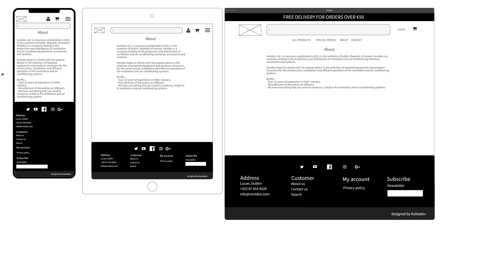
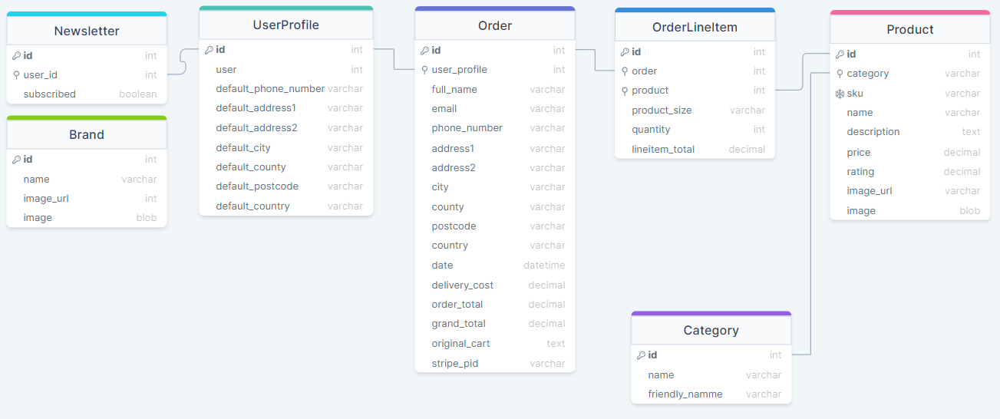

# Ventdes


\
&nbsp;
Live link can be found here - [Ventdes](https://ventdes.herokuapp.com/ "Ventdes")

\
&nbsp;

# Table of Contents
* [Database Disclaimer](#database-disclaimer "Database Disclaimer")
* [Background](#background "Background")
* [Mission Statement](#mission-statement "Mission Statement")
* [Target Audience](#target-audience "Target Audience")
* [Stakeholder Interviews](#stakeholder-interviews "Stakeholder Interviews")
    * [User Persona](#user-persona "User Persona")
    * [User Goals](#user-goals "User Goals")
    * [User Stories](#user-stories "User Stories")
    * [Requirements and Expectations](#requirements-and-expectations "Requirements and Expectations")
* [Planning](#Planning "Planning")
    * Scoring System
    * Scoring Results
* [Marketing](#marketing "Marketing")
* [Wireframes](#wireframes "Wireframes")
* [Design Choices](#design-choices "Design Choices")
    * Fonts
    * Colours
    * Images
* [Structure](#structure "Structure")
    * Site Structure and App Flow
    * Data Schema
    * Models
* [Features](#features "Features")
    * Existing Features
    * Future developments
* [Technologies used](#technologies-used "Technologies used")
    * Languages
    * Libraries, Frameworks and Tools
* [Testing](#testing "Testing")
    * Manual Testing
    * Lighthouse Testing
    * Code Validation
    * Bugs
    * Unfixed Bugs
* [Deployment](#deployment "Deployment")
    * Local Deployment
    * Deployment via Heroku
* [Credits](#credits "Credits")
* [Final Thoughts](#final-thoughts "Final Thoughts")

# Database Disclaimer
Heroku reguralry performs database maintenance. When this happens hostname and credentials change. If upon project submission such error occurs please contact me directly or through the student support department so I can update the link.
Please note this is outside my control. Below is the example of email from Heroku that is sent to user admin when this happens.

*Heroku
Your database DATABASE_URL on app-ventdes requires maintenance.
During this period, your database will become read-only. Once maintenance has completed, your database credentials and hostname will have changed, but we will update your app's config variables accordingly to reflect the new database connection string.*

*This automated maintenance is a necessary part of our Hobby tier plans, Dev and Basic. Should you need more control over maintenance windows, a production database (Standard tier or higher) offers more control over database maintenance, as we are able to schedule them in advance and provide better tools for self-served maintenance.*

*We expect maintenance to last just a few moments depending on the size of your database. We will notify you when maintenance begins, and again once it's complete.*

# Background
Ventdes Ltd. is a business established in 2021 in the outskirts of Dublin, Republic of Ireland. Ventdes is a company dealing in the production and distribution of ventilation and air conditioning elements, accessories and systems.

Ventdes helps its clients with the experts advice in the selection of essential equipment and products necessary for the construction, installation and efficient operation of the ventilation and air conditioning systems.

The company has spent the first year on building its cusotmer portfolio. This was based on the classic brick and mortar business model and direct face to face sales approach. Duing that year Ventdes has managed to built trust with its customers and has many returning clients. Going into second year company's growth slowed down. Employees has raised they voice that they spend most time placeing orders and have no time for cusotmer visits. Company has hit the cul de sac. 

In order to address its growth issues Ventdes has contacted Kukladev Ltd. who specialises in business assessment, evaluaiton and roadmap for further growth. Kukladev has reviewed, and mapped internal processes and suggested course of action. However, the three major bottlenecks recognised by Kukladev team are:
* manual order entry and limited options for cusotmers
* online presence
* marketing of new products

Kukladev has recognised that one of the bottlenecks for the growth is the number of orders processed daily, many of which are repeated orders. Each order is entered manually.  Currently, customers can only place orders via email, by phone or verbally in the reception.
Kukladev suggests to invest in the technology to make its operations effective before it will start adding new hires to the ineffective process.

Kukladev recommends to build online presence to address second obstacle preventing further growth. Current operation is limited to Dublin area and many cusotmers in the country never heard about the company. The target audience is small to medium businesses nationwide as well as sole traders and private customers.

The third major obstacle for growth is the marketing of product portfolio. Every new addition requires either a sales represntative visit, an individual email with offer that can easily get lost in the cusotmers inboxes or a phone call.
Kukladev propose to build product database that can be easily accessed by its cusotmers.

Kukladev has put forward a proposal to build an e-commerce website to address all three obstacles recognised above.


\
&nbsp;
[Back to Top](#table-of-contents)
\
&nbsp;

# Mission Statement
To create an e-commerce website application which will allow  Ventdes customers to place their orders easily. Find out about latest products and offers. Grow its customer base nationwide.

# Target Audience
The website will be used by small and medium businesses, sole traders and DIY enthusiasts.
* industry experts
* installators and fitters
* home owners and DIY enthusiasts
* others

# Stakeholder Interviews

## User Persona
Interviews were carried out with the selected group of people from each department to understand the problems that may face in day to day conversations with internal and external customers.
Additionaly, few of the most trusted cusotmers were selected to participate in the process and give their input to understand what information is critical for them to make the purchase decision.

## User Goals
From the resulting interviews, the user goals have been defined:

1. Easy process of placing an order
1. Product information, images and technical details
1. Price visibility
1. Ability to search the product database
1. Ability to rate products
1. Simple registration process
1. Visbility of userprofile
1. Visbility of order history
1. Newsletter with latest deals and product annoucements
1. Ability to deliver to various sites
1. Ability to add new and delete obsolete products
1. Ability to edit and update existing products

&nbsp;

## User Stories

| ID | User Category | User wants to... | So they can... |
|--|--|--|--|
| 01 | user | view a list of all products | purchase some of them
| 02 | user | view individual product details | check the price, detailed description, rating, images and sizes
| 03 | user | easily identify deals, clearance and special offers | to take advantage of any deals and save money
| 04 | user | view items selected for purchase | keep track of items in my basket while i browse the site
| 05 | user | view total of my basket | keep track of my spending
| 06 | user | select multiple quantites of the product | buy more of the sam product
| 07 | user | i want to share product with others | recommend it to my friends
| 08 | user | contact store owners | resolve potential problems i might have features
| 09 | user | view information about the company | find out about their history and build trust 
| 10 | user | view the company privicay policy | understand what information store may collect about me and that i am protected
| 11 | user | clearly see what is the purpose of the website | decide if i want explore further
| 12 | user | signup for newsletter | keep up to date with the latest products and offers
| 13 | unauthenticated user | register for an account | see my user profile
| 14 | unauthenticated user | receive an email confirmation after registering | verify that my account registration is successfull
| 15 | user | login or logout | access my profile and account information
| 16 | user | recover my password in case i lose it | recover access to my account
| 17 | user | have own user profile | view my order history and shipping addresses
| 18 | user | sort the list of avilable products | identify the best rated or priced products
| 19 | user | filter the products | see specific category
| 20 | user | search for products | find a specific product i am looking for
| 21 | user | see what i have searched for and the number of results | see if the product i am looking for is available
| 22 | user | add product to the basket | purchase it
| 23 | user | select the size and quantity of a product when purchasing it | ensure i don't accidentally select the wrong product, quantity or size
| 24 | user | update quantity of the product at checkout | change order details before i make payment
| 25 | user | see separate information about delivery charges | see what makes the total of my basket
| 26 | user | see if there is delivery charge threshold | make the final decision about my purchase
| 27 | user | pay for goods | finalise my order
| 28 | user | receive an email with order confirmation | esure that the order has been placed successfully
| 29 | store manager | add new products | expand my product offering and portfolio
| 30 | store manager | edit and update existing product | change details of the product
| 31 | store manager | delete product | remove obsolete products
| 32 | store manager | view list and value of all orders | see how many orders were placed and what is the value of them
| 33 | store manager | filter order status | see which orders are completed
| 34 | store manager | view list of all users | see how many users are registered
| 35 | store manager | edit and update existing users | change user statuses and access management

&nbsp;

## Requirements and Expectations

| Requirement | Expectation
| -- | --
| Visually appealing, neat and tidy design | Clear text. Intuitive navigation
| Responsive design to accommodate modern screen sizes | Website must work on phones, tablets and laptops
| Search and filter products | Adapt view to user needs
| Secure payment method | Ensure security of payment transactions
| Accessible contact | Contact details must be visible and easily accessible
| CRUD functionality for products | Easily maintain database records


\
&nbsp;
[Back to Top](#table-of-contents)
\
&nbsp;

## Planning
The items are graded in a 0 - 10 system in both importance and feasibility as per the grading system below.

### Scoring system
&nbsp;

| | Score - 0 | Score - 5 | Score - 10 |
|--|--|--| -- |
| Importance | Unwise use of time to address | Efforts should be made to accommodate these | Efforts MUST be made to address these
| Feasibility | Unwise use of time to address| Efforts should be made to accommodate these | Efforts MUST be made to address these

&nbsp;

The outcome is calculated by combining the scores from the *Importance* and *Feasibility* ratings. This then gives a final strategy rating of what items and where to focus on.

| | Score - 0 | Score - 10 | Score - 20 |
|--|--|--| -- |
| Item Description | Not viable | Efforts should be made | Efforts MUST be made

&nbsp;

### Scoring results

| User story ID | Importance Score | Feasibility Score | Outcome |
| --------------- | ----------| -----------| ---------- |
| 1 | 10 | 10 | 20 |
| 2 | 10 | 10 | 20 |
| 3 | 10 | 10 | 20 |
| 4 | 10 | 10 | 20 |
| 5 | 10 | 10 | 20 |
| 6 | 10 | 10 | 20 |
| 7 | 10 | 10 | 20 |
| 8 | 10 | 10 | 20 |
| 9 | 10 | 10 | 20 |
| 10 | 10 | 10 | 20 |
| 11 | 10 | 10 | 20 |
| 12 | 10 | 10 | 20 |
| 13 | 10 | 10 | 20 |
| 14 | 10 | 10 | 20 |
| 15 | 10 | 10 | 20 |
| 16 | 10 | 10 | 20 |
| 17 | 10 | 10 | 20 |
| 18 | 5 | 10 | 15 |
| 19 | 10 | 10 | 20 |
| 20 | 10 | 10 | 20 |
| 21 | 5 | 5 | 10 |
| 22 | 5 | 10 | 15 |
| 23 | 5 | 10 | 15 |
| 24 | 5 | 10 | 15 |
| 25 | 5 | 10 | 15 |
| 26 | 5 | 10 | 15 |
| 31 | 10 | 10 | 20 |
| 32 | 10 | 10 | 20 |
| 33 | 10 | 10 | 20 |
| 34 | 5 | 5 | 10 |
| 35 | 5 | 5 | 10 |

\
&nbsp;
[Back to Top](#table-of-contents)
\
&nbsp;

# Marketing
Ventdes has no online presence at all. Part of builiding company's digital image is to expoese it to various social media platforms.
It will allow the company to grow its digital community, engage with potential customers and build trust.

Kukladev recommends to create a Facebook page [Ventdes](https://www.facebook.com/Ventdes-102647435969280 "Ventdes") first, and then expand its presence to the other social media platforms:
* [Instagram](https://www.instagram.com/ "Instagram")
* [Pinterest](https://www.pinterest.ie/ "Pinterest")
* [LinkedIn](https://www.linkedin.com/ "LinkedIn")
* [Twitter](https://twitter.com/ "Twitter")

\
&nbsp;
[Back to Top](#table-of-contents)
\
&nbsp;

# Wireframes

* Homepage


* Sign In


* Sign Up


* Products List


* Product Details


* Cart


* About


* Contact


\
&nbsp;
[Back to Top](#table-of-contents)
\
&nbsp;

## Design Choices

### Fonts

Kukladeve has agreed with Ventdes to use following fonts from the Google Fonts library throughout the project.

* Content & Headings - [Lato](https://fonts.google.com/specimen/Lato "Lato")
* Category Titles - [Josefin Sans](https://fonts.google.com/specimen/Josefin+Sans "Josefin Sans")

### Colors

Color palette has been discussed. Client would like to keep minimalist design, classic black and white color palette with minimal noise and distraction from the content. Ventdes agreed several sets of colours following cusotmer guidlines and requirements.

&nbsp;


&nbsp;

The colours will be used as described in the table below

| Hex Value | Root variable name | Text | Button | Background | Opposite Colour
| -- | -- | -- | -- | -- | --
| #FFFFFF | white | X | X | X | black
| #222222 | black1 | X | X | X | white
| #000000 | black2 | X | X | X | white
| #666666 | grey-1 | X | X | X | white
| #737373 | grey-2 | X | X | X | white
| #AAB7C4 | grey-3 | X | X | X | black
| #B11841 | amaranth | X | X | X | white
| #DDDDDD | light-grey-1 | X | X | X | black
| #F4F4F4 | light-grey-2 | X | X | X | black


&nbsp;

All of the desired colour combinations have passed the [WebAIM Contrast Checker](https://webaim.org/resources/contrastchecker/ "WebAIM") and the results can be seen below.

| Foreground | Background | Results
| -- | -- | --
| black | white | [result](docs/designs/black.png "result")
| grey-1 | white | [result](docs/designs/grey-1.png "result")
| grey-2 | white | [result](docs/designs/grey-2.png "result")
| amaranth | white | [result](docs/designs/amaranth.png "result")
| white | light-grey-1 | [result](docs/designs/light-grey-1.png "result")
| white | light-grey-2 | [result](docs/designs/light-grey-2.png "result")

### Images
Customer supplied all images for the website. Kukladev asked for the images to be in high resolution and that they will go through process of optimising the size and converting to into format used in the modern web design. There will be minimal or no loss of the image quality. Image will load faster and will follow Googles SEO guidlines.

# Structure
## Site Structure and App Flow

### Flow Chart Diagram


### Website Structure


\
&nbsp;

## Schema


\
&nbsp;

## Models

### Product

| Name | Key | Type | Other Details |
| -- | -- | -- | --
| category | FK (Category) | | null=True, blank=True, on_delete=models.SET_NULL
| sku |  | CharField | max_length=254 | null=True, blank=True
| name |  | CharField | max_length=254, null=True, unique=True, validators=[MinLengthValidator(3)]
| description |  | TextField
| price |  | DecimalField | max_digits=12, decimal_places=2
| rating |  | DecimalField | min_value=0, max_value=5, MinValueValidator=0, MaxValueValidatror=5
| image_url | | URLField | max_length=1024, null=True
| image | | ImageField | null=True, blank=True


\
&nbsp;

### Category

| Name | Key | Type | Other Details |
| -- | -- | -- | -- |
| name |  | CharField | max_length=254, validators=[MinLengthValidator(3)]
| friendly_name |  | CharField | max_length=254, null=True, blank=True, validators=[MinLengthValidator(3)]

\
&nbsp;

### Order

| Name | Key | Type | Other Details |
| -- | -- | -- | -- |
| order_number |  | CharField | max_length=32, null=False, editable=False
| user_profile | ForeignKey | | on_delete=models.SET_NULL, null=True, blank=True, related_name='orders'
| full_name |  | CharField | max_length=50, null=False, blank=False
| email |  | EmailField | max_length=254, null=False, blank=False
| phone_number |  | CharField | max_length=20, null=False, blank=False
| address1 |  | CharField | max_length=80, null=False, blank=False
| address2 |  | CharField | max_length=80, null=True, blank=True
| city |  | CharField | max_length=50, null=False, blank=False
| county |  | CharField | max_length=80, null=True, blank=True
| postcode |  | CharField | max_length=20, null=False, blank=False
| country |  | CountryField | null=False, blank=False
| date |  | DateTimeField | auto_now_add=True
| delivery_cost |  | DecimalField | max_digits=12, decimal_places=2, null=False, default=0
| order_total |  | DecimalField | max_digits=18, decimal_places=2, null=False, default=0
| grand_total |  | DecimalField | max_digits=18, decimal_places=2, null=False, default=0
| original_cart |  | TextField | null=False, blank=False, default=''
| stripe_pid |  | CharField | max_length=254, null=False, blank=False, default=''

\
&nbsp;

### OrderLineItem

| Name | Key | Type | Other Details
| -- | -- | -- | --
| order | ForeignKey |  | null=False, blank=False, on_delete=models.CASCADE, related_name='lineitems'
| product | ForeignKey |  | null=False, blank=False, on_delete=models.CASCADE, related_name='lineitems'
| quantity |  | IntegerField | null=False, blank=False, default=0 
| lineitem_total |  | DecimalField | max_digits=12, decimal_places=2, null=False, blank=False, editable=False

### UserProfile

| Name | Key | Type | Other Details
| -- | -- | -- | --
| user |  | OneToOneField | on_delete=models.CASCADE
| default_phone_number |  | CharField | max_length=20, null=False, blank=False
| default_address1 |  | CharField | max_length=80, null=True, blank=True
| default_address2 |  | CharField | max_length=80, null=True, blank=True
| default_city |  | CharField | max_length=20, null=True, blank=True
| default_county |  | CharField | max_length=80, null=True, blank=True
| default_postcode |  | CharField | max_length=20, null=False, blank=False
| default_country |  | CountryField | null=False, blank=False
| subscribe_newsletter |  | BooleanField | default=False

### Newsletter
| Name | Key | Type | Other Details
| -- | -- | -- | --
| email | ForeignKey | | null=True, blank=True, unique=True 

### Brands
| Name | Key | Type | Other Details
| -- | -- | -- | --
| name | | CharField | max_length=254, null=True, blank=True
| image |  | ImageField | null=True, blank=True 

\
&nbsp;
[Back to Top](#table-of-contents)
\
&nbsp;


# Features

## Existing Features

### Navbar

The navigation bar is fully responsive to adapt to various screen sizes. It is **sticky**, it follows user when scrolling the page. Navbar changes depending on the user login status. Upon loading the landing page, unauthenticated user have an option to sign in. Authenticated user have additional options depending whether it is an administrator or standard user:

- Unauthenticated user view:

[Unauthenticated User View](docs/features/unauthenticated-user-view.png "Unauthenticated User View")


- Authenticated, standard user view:

[Authenticated User View](docs/features/authenticated-user-view.png "Authenticated User View")

Additionally authenticated user whether admin or not can see their profile and previous orders history.

- Authenticated, administrator or store owner view: 

[Admin Authenticatedn View](docs/features/admin-authenticated-view.png "Admin Authenticatedn View")

### Administrator

Administrator can see list of all products and categories. It can edit, update and delete products. Categories can also be edited.

[Admin Categories Edit](docs/features/admin-category-edit.png "Admin Categories Edit")

[Admin Product Add New](docs/features/admin-product-add-new.png "Admin Product Add New")

[Admin Product Edit](docs/features/admin-product-edit.png "Admin Product Edit")

### Homepage
The home page is divided into sections:
- Hero Image Carousel, with the slogans
- Deal Breakers, New Arrivals and Offers
- Trending products
- Footer


### About
- About the company, a brief description of the company


### Contact

- Contact form for any enquiries


### Products

The product list display all products available to purchase. Each product is displayed in the separate card. User can view product details when click on the product image in the product card.

[Products List](docs/features/products-list.png "Products List")

### Product Details

The products details page displays additional information about the item. Here user have also an option to change quantity and add it to the cart.

[Products Details](docs/features/products-details.png "Products Details")

### Search and Filters
User can narrow down the list of products using the search option or filtering the list by specific category, pric, rating etc. These simple yet very effective funcitons will display only items that contain searched keywords or specific filter criteria.

* [Search Results](docs/features/search-results.pdf "Search Results")
* [Filtered Result](docs/features/filter-results.pdf "Filter Result")

### Footer

The footer is responsive to adapt to various screen sizes. Social media links drop down slightly when user hover over them. The other links in the footer are highlighted when user hovers over them. Company name in the footer acts as a home page (back to top). There is also information about the copyright and the designer.


### Authentication

Newly registered user will receive account verification email. There is a 24h time limit for the user to confirm the email before the link will expire.


\
&nbsp;
[Back to Top](#table-of-contents)
\
&nbsp;

## Future developments

There are a few ideas that I would like to implement in the future:
* Additional user profiles and access levels -> administrator, manager, employee
* Admin's ability to activate and deactivate accounts
* Add to cart button on the product card in the product list view
* Additional order status types that trigger response to customer i.e. 'in preparation', 'ready to dispatch', 'shipped'
* Order tracking capabilities, where cusotmer can track courier status
* Biometric login
* Stock levels view with visual cues about low, medium and high quantities in stock
* Stock report informing about stock turnover rates per product and flag slow or non-selling products for sell-off or clearance deals
* User profile picture
* Ability to dectivate products without deleting their sales history
* Ability to mass upload products using external data file i.e. excel file
* Allow user to share product via social media
* Allow user to add product to favourites
* Allow user to add product to wishlist that will trigger an automated email about any deals for it

\
&nbsp;
[Back to Top](#table-of-contents)
\
&nbsp;

# Technologies used

## Languages

| Languages | Link |
|--|--|
| HTML | [HTML](https://en.wikipedia.org/wiki/HTML5 "HTML")
| CSS | [CSS](https://en.wikipedia.org/wiki/CSS "CSS")
| JavaScript | [JavaScript](https://en.wikipedia.org/wiki/JavaScript "JS")
| jQuery | [jQuery](https://jquery.com/ "jQuery")
| Python | [Python](https://en.wikipedia.org/wiki/Python_(programming_language) "Python")
| Markdown | [Markdown](https://en.wikipedia.org/wiki/Markdown)

## Libraries, Frameworks and Tools
| Libraries / Frameworks / Tools| Description | Link |
|--|--|--|
| Django | Database Driven Framework | [django](https://en.wikipedia.org/wiki/Django_(web_framework) "django")
| gunicorn|HTTP Interface Server | [gunicorn](https://en.wikipedia.org/wiki/Gunicorn "gunicorn")
| psycopg2| Database adaptor | [psycopg2](https://wiki.postgresql.org/wiki/Psycopg "psycogg2")
| Amazon Web Services (AWS) | File storage and management |[Amazon Web Services (AWS)](https://cloudinary.com/ "Amazon Web Services (AWS)")
| cloudinary | Image management | [cloudinary](https://cloudinary.com/ "cloudinary")
| django-allauth | User authentication | [django-allauth](https://django-allauth.readthedocs.io/en/latest/index.html "django-allauth")
| django crispy forms | Styling forms | [crispy-forms](https://django-crispy-forms.readthedocs.io/en/latest/ "crispy-forms")
| Site mockup | Mockup of site on different screen sizes | [Multi Device Website Mockup Generator](https://techsini.com/multi-mockup/index.php "Mockup Generator")
| Sitemap Generator | Generating the site map | [xml-sitemaps](https://www.xml-sitemaps.com/ "XML-Sitemaps.com")
| HTML Validation | Validating HTML | [w3.org](https://validator.w3.org/ "W3C")
| CSS Validation | Validating CSS | [w3.org](https://jigsaw.w3.org/css-validator/ "W3C")
| JS Validation|Validating JS & jQuery | [jshint](https://jshint.com/ "JSHint")
| PEP8 | Validating python | [PEP8](http://pep8online.com/ "PEP8")
| Lucid | Site structure design | [Lucid](https://lucid.co/ "Lucid")
| Pexels | Images |[Pexels](https://pexels.com/ "Pexels")
| TinyIMG | Image conversion | [TinyIMG](https://tiny-img.com/webp/ "TinyIMG")
| TinyPng | Image optimisation | [TinyPNG](https://tinypng.com/ "TinyPNG")
| jpg2png.com | Image converter | [jpg2png](https://jpg2png.com/ "jpg2png")
| GitPod | Development environment | [Gitpod](https://www.gitpod.io/ "Gitpod")
| WireframePro | Structure and App Flow | [diagrams.net](https://www.diagrams.net/ "diagrams.net")
| WireframePro | Wireframes | [WireframePro](https://mockflow.com/design/wireframepro/ "WireframePro")
| drawSQL | Database Schema | [drawSQL](https://drawsql.app/ "drawSQL")
| Bootstrap | Responsive design | [Bootstrap](https://getbootstrap.com "Bootstrap")
| Font Awesome | Icons | [Font Awesome library](https://fontawesome.com/ "Font Awesome")
| Colours | Colour pallet | [coolors](https://coolors.co/ "coolors")
| Google Fonts| Fonts | [Google Fonts](https://fonts.google.com/ "Fonts")
| WebAIM | Colour contrast checks | [WebAIM](https://webaim.org/resources/contrastchecker/ "WebAIM")
|generateprivacypolicy.com | Privacy Policy Generator| [Generate Privacy Policy](https://www.generateprivacypolicy.com/)
| favicon.io | Create the favicon | [favicon.io](https://favicon.io/ "favicon.io")


# Testing

\
&nbsp;

### Manual Testing

| ID |  User wants to... | Issue Number | Comments
|--|--|--| -- |
| 01 | Register new account | [Issue #1](https://github.com/lukaszkukla/ventdes/issues/1 "Issue #1") | User can register a new account
| 02 | Login and logout | [Issue #2](https://github.com/lukaszkukla/ventdes/issues/2 "Issue #2") | User can login to registered account
| 03 | Product list view | [Issue #10](https://github.com/lukaszkukla/ventdes/issues/10 "Issue #10") | User can view a list of all products
| 04 | Product details view | [Issue #11](https://github.com/lukaszkukla/ventdes/issues/11 "Issue #11") | User can view individual product details
| 05 | Product filtering | [Issue #15](https://github.com/lukaszkukla/ventdes/issues/15 "Issue #15") | User can filter the products
| 06 | Product searching | [Issue #16](https://github.com/lukaszkukla/ventdes/issues/16 "Issue #16") | User can search for products
| 07 | Product search result view | [Issue #17](https://github.com/lukaszkukla/ventdes/issues/17 "Issue #17") | User can see what I have searched for and the number of results
| 08 | Product sorting | [Issue #14](https://github.com/lukaszkukla/ventdes/issues/14 "Issue #14") | User can sort the list of available products
| 09 | Promotions list view | [Issue #12](https://github.com/lukaszkukla/ventdes/issues/12 "Issue #12") | User can easily identify deals, clearance and special offers
| 10 | Product quantity selector | [Issue #13](https://github.com/lukaszkukla/ventdes/issues/13 "Issue #13") | User can select multiple quantities of the product
| 11 | Add to cart | [Issue #28](https://github.com/lukaszkukla/ventdes/issues/28 "Issue #28") | User can add product to the cart
| 12 | Cart products value | [Issue #29](https://github.com/lukaszkukla/ventdes/issues/29 "Issue #29") | User can view total of the cart
| 13 | Cart quantity selector | [Issue #30](https://github.com/lukaszkukla/ventdes/issues/30 "Issue #30") | User can select the quantity of a product when purchasing it
| 14 | Checkout update functionality | [Issue #31](https://github.com/lukaszkukla/ventdes/issues/31 "Issue #31") | User can update quantity of the product at checkout
| 15 | View individaul product details | [Issue #15](https://github.com/lukaszkukla/ventdes/issues/15 "Issue #15") | Detailed view of the selected product
| 16 | Cart charges breakdown view | [Issue #32](https://github.com/lukaszkukla/ventdes/issues/32 "Issue #32") | User can see separate info about delivery charges
| 17 | Delivery charge field | [Issue #33](https://github.com/lukaszkukla/ventdes/issues/33 "Issue #33") | User can see if there is delivery charge threshold
| 18 | Cart products and quantities | [Issue #34](https://github.com/lukaszkukla/ventdes/issues/34 "Issue #34") | User can view items selected for purchase
| 19 | Add to the cart toast message | [Issue #35](https://github.com/lukaszkukla/ventdes/issues/35 "Issue #35") | User can see a confirmation message when I add product to the cart
| 20 | Update the cart toast message | [Issue #36](https://github.com/lukaszkukla/ventdes/issues/36 "Issue #36") | User can see a confirmation message when I update the cart
| 21 | Remove item from the cart toast message | [Issue #37](https://github.com/lukaszkukla/ventdes/issues/37 "Issue #37") | User can see a confirmation message when I remove product from the cart
| 22 | Error toast message | [Issue #38](https://github.com/lukaszkukla/ventdes/issues/38 "Issue #38") | User can see an error message when something goes wrong
| 23 | Stripe payments | [Issue #39](https://github.com/lukaszkukla/ventdes/issues/39 "Issue #39") | User can pay for goods
| 24 | User profile | [Issue #42](https://github.com/lukaszkukla/ventdes/issues/42 "Issue #42") | User can view its own account details and history of previous orders
| 25 | Store management - add new products | [Issue #44](https://github.com/lukaszkukla/ventdes/issues/44 "Issue #44") | Store manager can add new products
| 26 | Store management - edit and update products | [Issue #45](https://github.com/lukaszkukla/ventdes/issues/45 "Issue #45") | Store manager can edit and update existing product
| 27 | Store management - delete products | [Issue #46](https://github.com/lukaszkukla/ventdes/issues/46 "Issue #46") | Store manager can delete any product
| 28 | Newsletter | [Issue #63](https://github.com/lukaszkukla/ventdes/issues/63 "Issue #63") | User can signup for newsletter
| 29 | Cart quantity | [Issue #66](https://github.com/lukaszkukla/ventdes/issues/66 "Issue #66") | User is not allowed to have more than 9999 units of a single product in the cart
| 30 | Maximum cart value | [Issue #67](https://github.com/lukaszkukla/ventdes/issues/67 "Issue #67") | Maximum value of single transaction is limited to €250,000. User is warned if this is exceeded.
| 31 | Order processing | [Issue #68](https://github.com/lukaszkukla/ventdes/issues/68 "Issue #68") | Process order and receive email confirmation
| 32 | Register, login, logout, reset password | [Issue #69](https://github.com/lukaszkukla/ventdes/issues/69 "Issue #69") | Full cycle from registering the account to passwrod recovery

\
&nbsp;
[Back to Top](#table-of-contents)
\
&nbsp;

## Automated Testing
This is the part I have been struggling with and will have to spend a bit more time to produce something that added value. 

\
&nbsp;
[Back to Top](#table-of-contents)
\
&nbsp;

## Lighthouse Testing

| Issue Number |  Title | Link | Comments 
|--|--|--|--|
| 00 | Lightouse | [Issue 65#](https://github.com/lukaszkukla/ventdes/issues/65 "Issue #65") |  Testing with Google Lighthouse |


\
&nbsp; 

## Code Validation

### HTML
All HTML files were tested using browser's "View page source" function due to djago being embeded in the code. Generated code was then pasted to HTML validator.

| File Name | File Path | Result | W3C | Comments |
|--|--|--|--|--|
| index.html | /ventdes/home/templates/home/html-markup-test-index.html | PASS | [link](docs/validation/html/home.png "link") ||
| index.html | /ventdes/products/templates/products/products.html | PASS | [link](docs/validation/html/html-markup-test-products.png "link") ||
| index.html | /ventdes/cart/templates/cart/cart.html | PASS | [link](docs/validation/html/html-markup-test-cart.png "link") ||
| index.html | /ventdes/checkout/templates/checkout/checkout.html | PASS | [link](docs/validation/html/html-markup-test-checkout.png "link") ||
| index.html | /ventdes/home/templates/home/html-markup-test-about.html | PASS | [link](docs/validation/html/about.png "link") ||
| index.html | /ventdes/policy/templates/policy/privacy.html | PASS | [link](docs/validation/html/html-markup-test-privacy-policy.png "link") ||
| index.html | /ventdes/contact/templates/contact/html-markup-test-contact.html | PASS | [link](docs/validation/html/contact.png "link") ||
| index.html | /ventdes/profiles/templates/profiles/profile.html | PASS | [link](docs/validation/html/html-markup-test-profile.png "link") ||
| index.html | /ventdes/products/templates/products/add_product.html | PASS | [link](docs/validation/html/html-markup-test-products-add-new.png "link") ||
| index.html | /ventdes/products/templates/products/edit_product.html | PASS | [link](docs/validation/html/html-markup-test-products-edit.png "link") ||
| index.html | /ventdes/products/templates/products/categories.html | PASS | [link](docs/validation/html/html-markup-test-categories.png "link") ||
| index.html | /ventdes/products/templates/products/edit_category.html | PASS | [link](docs/validation/html/html-markup-test-categories-edit.png "link") ||


\
&nbsp; 

### CSS
| File Name | File Path | Result | W3C | Comments |
|--|--|--|--|--|
| base.css | static/css/base.css | PASS | [link](docs/validation/css/base.png "link") ||
| base.css | profiles/static/profiles/css/profiles.css | PASS | [link](docs/validation/css/css-test-profiles.png "link") ||
| base.css | checkout/static/checkout/css/checkout.css | PASS | [link](docs/validation/css/css-test-checkout.png "link") ||

\
&nbsp; 

### JS
| File Name | File Path | Result | JSHint | Comments |
|--|--|--|--|--|
| app.js | templates/allauth/account/email.html | PASS | [link](docs/validation/js/js-test-email.png "link") ||
| app.js | products/templates/products/products.html | PASS | [link](docs/validation/js/js-test-products-002.png "link") ||
| app.js | products/templates/products/includes/quantity_input_script.html | PASS | [link](docs/validation/js/js-test-quantity-input-script.png "link") ||
| app.js | products/templates/products/add_product.html | PASS | [link](docs/validation/js/js-test-add-product.png "link") ||
| app.js | products/static/products/js/script.js | PASS | [link](docs/validation/js/js-test-products-001.png "link") ||
| app.js | cart/templates/cart/cart.html | PASS | [link](docs/validation/js/js-test-cart.png "link") ||
| app.js | profiles/static/profiles/js/countryfield.js | PASS | [link](docs/validation/js/js-test-country-field.png "link") ||
| app.js | checkout/static/checkout/js/stripe_elements.js | PASS | [link](docs/validation/js/js-test-stripe-elments.png "link") ||


\
&nbsp; 

### Python
| File Name | File Path | Result | PEP8 | Comments |
|--|--|--|--|--|
| contexts.py | cart/contexts.py | PASS | [link](docs/validation/python/py-test-cart-contexts.png "link") ||
| forms.py | cart/urls.py | PASS | [link](docs/validation/python/py-test-cart-urls.png "link") ||
| views.py | cart/views.py | PASS | [link](docs/validation/python/py-test-cart-views.png "link") ||
| admin.py | checkout/admin.py | PASS | [link](docs/validation/python/py-test-checkout-admin.png "link") ||
| forms.py | checkout/forms.py | PASS | [link](docs/validation/python/py-test-checkout-forms.png "link") ||
| models.py | checkout/models.py | PASS | [link](docs/validation/python/py-test-checkout-models.png "link") ||
| signals.py | checkout/signals.py | PASS | [link](docs/validation/python/py-test-checkout-signals.png "link") ||
| urls.py | checkout/urls.py | PASS | [link](docs/validation/python/py-test-checkout-urls.png "link") ||
| views.py | checkout/views.py | PASS | [link](docs/validation/python/py-test-checkout-views.png "link") ||
| webhook_handler.py | checkout/webhook_handler.py | PASS | [link](docs/validation/python/py-test-checkout-webhook_handler.png "link") ||
| webhooks.py | checkout/webhooks.py | PASS | [link](docs/validation/python/py-test-checkout-webhooks.png "link") ||
| forms.py | contact/forms.py | PASS | [link](docs/validation/python/py-test-contact-forms.png "link") ||
| views.py | contact/views.py | PASS | [link](docs/validation/python/py-test-contact-views.png "link") ||
| urls.py | home/urls.py | PASS | [link](docs/validation/python/py-test-home-urls.png "link") ||
| views.py | home/views.py | PASS | [link](docs/validation/python/py-test-home-views.png "link") ||
| admin.py | newsletter/admin.py | PASS | [link](docs/validation/python/py-test-newsletter-admin.png "link") ||
| contexts.py | newsletter/contexts.py | PASS | [link](docs/validation/python/py-test-newsletter-contexts.png "link") ||
| forms.py | newsletter/forms.py | PASS | [link](docs/validation/python/py-test-newsletter-forms.png "link") ||
| models.py | newsletter/models.py | PASS | [link](docs/validation/python/py-test-newsletter-models.png "link") ||
| urls.py | newsletter/urls.py | PASS | [link](docs/validation/python/py-test-newsletter-urls.png "link") ||
| views.py | newsletter/views.py | PASS | [link](docs/validation/python/py-test-newsletter-views.png "link") ||
| views.py | policy/views.py | PASS | [link](docs/validation/python/py-test-policy-views.png "link") ||
| admin.py | products/admin.py | PASS | [link](docs/validation/python/py-test-products-admin.png "link") ||
| apps.py | products/apps.py | PASS | [link](docs/validation/python/py-test-products-apps.png "link") ||
| forms.py | products/forms.py | PASS | [link](docs/validation/python/py-test-products-forms.png "link") ||
| models.py | products/models.py | PASS | [link](docs/validation/python/py-test-products-models.png "link") ||
| urls.py | products/urls.py | PASS | [link](docs/validation/python/py-test-products-urls.png "link") ||
| views.py | products/views.py | PASS | [link](docs/validation/python/py-test-products-views.png "link") ||
| widgets.py | products/widgets.py | PASS | [link](docs/validation/python/py-test-products-widgets.png "link") ||
| models.py | profiles/models.py | PASS | [link](docs/validation/python/py-test-profiles-models.png "link") ||
| forms.py | profiles/forms.py | PASS | [link](docs/validation/python/py-test-profiles-forms.png "link") ||
| urls.py | profiles/urls.py | PASS | [link](docs/validation/python/py-test-profiles-urls.png "link") ||
| views.py | profiles/views.py | PASS | [link](docs/validation/python/py-test-profiles-views.png "link") ||
| urls.py | ventdes/urls.py | PASS | [link](docs/validation/python/py-test-ventdes-urls.png "link") ||
| views.py | ventdes/views.py | PASS | [link](docs/validation/python/py-test-ventdes-views.png "link") ||
| custom_storages.py | custom_storages.py | PASS | [link](docs/validation/python/py-test-custom_storages.png "link") ||


\
&nbsp; 


## Bugs

| Issue Number |  Title | Comments 
|--|--|--|
| [Issue #64](https://github.com/lukaszkukla/ventdes/issues/64 "Issue #64") | Embedded Google maps have no title that affects accessibility performance.  |
| [Issue #62](https://github.com/lukaszkukla/ventdes/issues/62 "Issue #62") | Stripe payment 500 error | Stripe website showing 500 error when processing payments after recent update.  |
| [Issue #52](https://github.com/lukaszkukla/ventdes/issues/52 "Issue #52") | Profile link on mobile size | Profile link on mobile size is not redirecting user to profile screen. |
| [Issue #51](https://github.com/lukaszkukla/ventdes/issues/51 "Issue #51") | Product addition - frontend | NoReverse match error appear when trying to save product. |
| [Issue #41](https://github.com/lukaszkukla/ventdes/issues/41 "Issue #41") | Stripe webhooks failing | When processing the payment for the order Stripe webhooks succeed but return 401 error.  |
| [Issue #27](https://github.com/lukaszkukla/ventdes/issues/27 "Issue #27") | Cart text spacing | A clear and concise description of what the bug is.  |
| [Issue #26](https://github.com/lukaszkukla/ventdes/issues/26 "Issue #26") | Search bar mobile | Search bar on mobile device is too small.  |
| [Issue #24](https://github.com/lukaszkukla/ventdes/issues/24 "Issue #24") | Filter by category | Product page filtered by category display ERR_HTTP2_PROTOCOL_ERROR  |
| [Issue #23](https://github.com/lukaszkukla/ventdes/issues/23 "Issue #23") | Carousel image partially hidden on mobile | Part of the hero image is hidden behind navbar on mobile devices.  |
| [Issue #22](https://github.com/lukaszkukla/ventdes/issues/22 "Issue #22") | Unexpected keyword argument | Image on product card does not load.  |
| [Issue #9](https://github.com/lukaszkukla/ventdes/issues/9 "Issue #9") | Navbar links are not aligning in center | Navbar links to other pages are aligned left.  |
| [Issue #72](https://github.com/lukaszkukla/ventdes/issues/72 "Issue #72") | XXXXXXXXXXX | OOOOOOOOOOOOOOO  |
| [Issue #72](https://github.com/lukaszkukla/ventdes/issues/72 "Issue #72") | XXXXXXXXXXX | OOOOOOOOOOOOOOO  |
| [Issue #72](https://github.com/lukaszkukla/ventdes/issues/72 "Issue #72") | XXXXXXXXXXX | OOOOOOOOOOOOOOO  |
| [Issue #72](https://github.com/lukaszkukla/ventdes/issues/72 "Issue #72") | XXXXXXXXXXX | OOOOOOOOOOOOOOO  |
| [Issue #72](https://github.com/lukaszkukla/ventdes/issues/72 "Issue #72") | XXXXXXXXXXX | OOOOOOOOOOOOOOO  |
| [Issue #72](https://github.com/lukaszkukla/ventdes/issues/72 "Issue #72") | XXXXXXXXXXX | OOOOOOOOOOOOOOO  |


\
&nbsp;

## Unfixed Bugs
Description of the bug


* [Error #1 - with reference](docs/bugs/password-error-001.png "error name") error brief description [Error #1 - without reference](docs/bugs/error-001.png "password error") 

\
&nbsp;
[Back to Top](#table-of-contents)
\
&nbsp;

# Deployment

This project was created using [GitHub](https://github.com/ "GitHub"), [Gitpod](https://www.gitpod.io/ "Gitpod") and the code was written using [Micorsoft Visual Studio Code](https://code.visualstudio.com/). The project was deployed to Heroku right from the start to anticipate any possible bugs and errors in early stages of the development. I controlled each deploymnet to Heroku and left automatic deployment option off. I used interchangeably two ways to deploy new piece of code to heroku:

* Via Visual Code Terminal
```
heroku login -i
Email: __enter_heroku_account_email__
Password: __enter_heroku_account_password__
heroku git:remote -a __your _heroku_app_name__
git push heroku main
```

* Via Heroku UIElements
```
Login to Heroku dashboard
Choose your own app
Choose 'Deploy' from the top menu bar
Scroll dowon to 'Manual deploy' section
Click 'Deploy Branch' button to deploy
```

## Local Deployment

As Gitpod was the IDE that was used to create the project, the following local deployment steps are specific to Gitpod.


### Cloudinary
* [Cloudinary](https://cloudinary.com/ "Cloudinary")
* Click on the *Sign Up For Free* button
* When the account is created, you should see the *API Environment variable*, we will need this for a later process.


### GitHub
* Visit [Github](https://github.com/ "Github")
* Create an account or log in


#### GitHub Desktop
* Navigate to the [repository](https://github.com/lukaszkukla/ventdes "repository")
* Click on the *Code* button above the file list
* Select *Open with GitHub Desktop*

### Set up your Workspace
When you have your version of the original repository,

* In the terminal run
```
pip3 install -r requirements.txt
```
* In the root directory create a file called **env.py** and add the following content, the content of these, must match the Config Vars in the Heroku deployment section

```py
import os
os.environ['DATABASE_URL'] = "FROM HEROKU DEPLOYMENT SECTION, DATABASE_URL CONFIG VAR"
os.environ['SECRET_KEY'] = "FROM HEROKU DEPLOYMENT SECTION SECRET_KEY CONFIG VAR"
os.environ['CLOUDINARY_URL'] = "API ENVIRONMENT VARIABLE REMOVE 'CLOUDINARY_URL=' FROM BEGINING"
os.environ['DEVELOP'] = '1'
```

* Add the env.py file to the .gitignore file to ensure that its contents are not made public

* Migrate the database models with the following command in the terminal
```
python3 manage.py migrate
```

* Create a superuser and set up the credentials with the following command
```
python3 manage.py createsuperuser
```

* Run the application locally with the command
```
python3 manage.py runserver
```

* To access the admin page using the superuser details just created, add /admin to the end of the URL.

### Deployment via Heroku
* Visit [heroku.com](https://www.heroku.com/home "Heroku")
* Create a new account or sign in
* From the dashboard, select **New** and then **Create new app**
* Enter an individual app name into the text box, select a region from the dropdown and then press **Create app**
* A Heroku app has now been created and the **Deploy** tab is opened. 
* Open the *Resources* tab and in the search bar for *Add-ons* type *Postgres*
* Select *Heroku Postgres*, on the popup, ensure the dropdown is set to *Hobby Dev - Free* and then *Submit Order Form*
* Open the *Settings* tab and then click on the *Reveal Config Vars* button and the database_url should be populated.
* Fill out the rest of the config vars with the content of the table below by filling out the *Key* and *Value* and clicking on *Add* for each entry 

| Key | Value |
| --- | --- |
| AWS_ACCESS_KEY_ID | ID from AWS
| AWS_SECRET_ACCESS_KEY_ID | Secret access key from AWS
| DATABASE_URL | url for postgres database
| SECRET_KEY | Secret Key generated from [here](https://miniwebtool.com/django-secret-key-generator/ "Secret Key Generator")
| EMAIL_BACKEND | django core mail backend smtp
| EMAIL_HOST | smtp.gmail.com
| EMAIL_HOST_PASSWORD | Password from Gmail authentication setup
| EMAIL_HOST_USER | Gmail account that will be used
| STRIPE_PUBLIC_KEY | From the stripe section
| STRIPE_SECRET_KEY | From the stripe section
| STRIPE_WH_SECRET | From the stripe section

* In the buildpacks section of the settings tab, click on **Add Buildpack**, select **python** and then save changes
* Open the **Deploy** tab
* In the deployment method section, select **GitHub** and confirm the connection.
* Enter the repo name into the text box and click **Search**. When the correct repo appears below, click **Connect**
* Return to the Gitpod workspace and in the root directory create a file called *Procfile*
* In the *Procfile* enter the following line including your project name
```
web: gunicorn YOUR_PROJECT_NAME.wsgi
```
* Add and commit to GitHub
```
git add .
git commit -m "commit message goes here"
git push
```
* Add your Heroku app URL to ALLOWED_HOSTS in your settings.py file
```py
ALLOWED_HOSTS = ['YOUR_PROJECT_NAME.herokuapp.com', 'localhost']
```
* Return to Heroku
* In the Automatic deploys section, click **Enable Automatic Deploys**. This updates every time GitHub code is pushed
* To complete the process click on the **Deploy Brach** button in the Manual deploy section, this will take a few seconds to complete while Heroku builds the app
* A message will appear informing you that the app was successfully deployed and a **View** button will bring you to the live site


### Stripe
* Visit Stripe by following this [link](https://dashboard.stripe.com/register "Stirpe")
* And register for an account, for this project as it is only set up for test payments the *activate payments* section can be skipped.
* From the dashboard, click on the *Developers* and then on the lefthand side, *Webhooks*.
* Click on the *Add endpoint button* and paste in the Heroku URL with `/checkout/wh/` included on the end, for example, this project would be `https://ventdes.herokuapp.com/checkout/wh/`
* Add an optional description if required
* Click the *Select events* button and mark the checkbox for *Select all events*, then click *
Add events*.
* Scroll to the very bottom of the page and then click *Add endpoint*
* From the webhook page under the URL, reveal the Signing secret, this will need to be added to Heroku config vars as STRIPE_WH_SECRET.
* Still in the developer's section of Stripe, click on the *API keys* link on the left, the *Publishable key* (STRIPE_PUBLIC_KEY) and *Secret key* (STRIPE_SECRET_KEY) will also be needed to be added to Heroku config vars.

### Email setup
This project is using Gmail as its email provider. Other providers can be used but the setup will differ slightly.

* Create a Gmail account, or log in if you already have an account
* At the top right waffle menu select *Account*, then on the left of the screen select *Security*
* In the *Signing into Google* section turn on 2-step verification and then click *Get started*
* Enter your password and select a verification method
* Go back to the security page and under the 2-step verification there is a new option called *App passwords*, click it.
* In the select app dropdown, select *Mail*
* In the select device dropdown, select *Other* and type in *Django*
* The app password will be shown, copy this and add it to the Heroku config vars as EMAIL_HOST_PASS.

\
&nbsp;
[Back to Top](#table-of-contents)
\
&nbsp;

# Credits
* [Simen Daehlin](https://github.com/Eventyret "Simen Daehlin") for advice and direction and continual support
* [Sam Timmins](https://github.com/sam-timmins/ "Sam Timmins") for readme template, structure and some ideas that sparked from using it
* Peer community on [Code Institute](https://codeinstitute.net/ie/) Slack channels
* Kasia_ci from [Code Institute](https://codeinstitute.net/ie/) - for keeping up the spirit and leading weekly standups
* [Human Code](https://www.youtube.com/watch?v=X1gQB2BGJA8 "Reverse and Reverse_Lazy") - understand reverse and reverse_lazy
* [CodingEntrepreneurs](https://www.youtube.com/channel/UCWEHue8kksIaktO8KTTN_zg "CodingEntrepreneurs") for help on Django and testing
* [Codemy.com](https://www.youtube.com/channel/UCFB0dxMudkws1q8w5NJEAmw "Codemy.com") for help with Django
* [Very Academy](https://www.youtube.com/watch?v=zszYgUXnId8 "Very Academy") for showing how to restric access to class based views 

\
&nbsp;
[Back to Top](#table-of-contents)
\
&nbsp;

# Final Thoughts
This is was so far the most challenging project I have done. Django is a really neat tool. I need more time to play with it to understand it better. Some in-built function are really great and really speed up the development time. Yet... 'with great tools come great learning curve' there were time that I was ready to give up but I kept going and I manage to bring this project to completion. It was the thoughest one but also most enjoyable one.

\
&nbsp;
[Back to Top](#table-of-contents)
\
&nbsp;