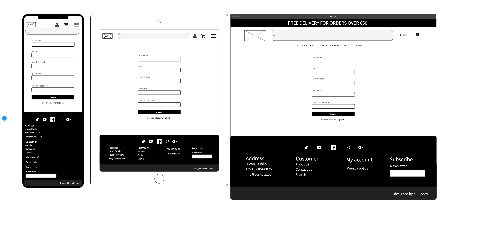

# Ventdes


\
&nbsp;
Live link can be found here - [Ventdes](https://ventdes.herokuapp.com/ "Ventdes")

\
&nbsp;

# Table of Contents
* [Database Disclaimer](#database-disclaimer "Database Disclaimer")
* [Background](#background "Background")
* [Mission Statement](#mission-statement "Mission Statement")
* [Target Audience](#target-audience "Target Audience")
* [Stakeholder Interviews](#stakeholder-interviews "Stakeholder Interviews")
    * [User Persona](#user-persona "User Persona")
    * [User Goals](#user-goals "User Goals")
    * [User Stories](#user-stories "User Stories")
    * [Requirements and Expectations](#requirements-and-expectations "Requirements and Expectations")
* [Planning](#Planning "Planning")
    * Scoring System
    * Scoring Results
* [Marketing](#marketing "Marketing")
* [Wireframes](#wireframes "Wireframes")
* [Design Choices](#design-choices "Design Choices")
    * Fonts
    * Colours
    * Images
* [Structure](#structure "Structure")
    * Site Structure and App Flow
    * Data Schema
    * Models
* [Features](#features "Features")
    * Existing Features
    * Future developments
* [Technologies used](#technologies-used "Technologies used")
    * Languages
    * Libraries, Frameworks and Tools
* [Testing](#testing "Testing")
    * UX Testing
    * Manual Testing
    * Code Validation
    * Bugs
    * Unfixed Bugs
* [Deployment](#deployment "Deployment")
    * Local Deployment
    * Deployment via Heroku
* [Credits](#credits "Credits")
* [Final Thoughts](#final-thoughts "Final Thoughts")

# Database Disclaimer
Heroku reguralry performs database maintenance. When this happens hostname and credentials change. If upon project submission such error occurs please contact me directly or through the student support department so I can update the link.
Please note this is outside my control. Below is the example of email from Heroku that is sent to user admin when this happens.

*Heroku
Your database DATABASE_URL on app-ventdes requires maintenance.
During this period, your database will become read-only. Once maintenance has completed, your database credentials and hostname will have changed, but we will update your app's config variables accordingly to reflect the new database connection string.*

*This automated maintenance is a necessary part of our Hobby tier plans, Dev and Basic. Should you need more control over maintenance windows, a production database (Standard tier or higher) offers more control over database maintenance, as we are able to schedule them in advance and provide better tools for self-served maintenance.*

*We expect maintenance to last just a few moments depending on the size of your database. We will notify you when maintenance begins, and again once it's complete.*

# Background
Ventdes Ltd. is a business established in 2021 in the outskirts of Dublin, Republic of Ireland. Ventdes is a company dealing in the production and distribution of ventilation and air conditioning elements.

Ventdes helps its clients with experts advice in the selection of essential equipment and products necessary for the construction, installation and efficient operation of the ventilation and air conditioning systems.

The company has spent the first year on building its cusotmer portfolio. This was based on the classic brick and mortar business model and direct face to face sales approach. Duing that year Ventdes has managed to built trust with its customers and has many returning clients. Going into second year company's growth slowed down. Employees has raised they voice that they spend most time placeing orders and have no time for cusotmer visits. Company has hit the cul de sac. 

In order to address its growth issues Ventdes has contacted Kukladev Ltd. who specialises in business assessment, evaluaiton and roadmap for further growth. Kukladev has reviewed, and mapped internal processes and suggested course of action. However, the three major bottlenecks recognised by Kukladev team are:
* manual order entry and limited options for cusotmers
* online presence
* marketing of new products

Kukladev has recognised that one of the bottlenecks for the growth is the number of orders processed daily, many of which are repeated orders. Each order is entered manually.  Currently, customers can only place orders via email, by phone or verbally in the reception.
Kukladev suggests to invest in the technology to make its operations effective before it will start adding new hires to the ineffective process.

Kukladev recommends to build online presence to address second obstacle preventing further growth. Current operation is limited to Dublin area and many cusotmers in the country never heard about the company. The target audience is small to medium businesses nationwide as well as sole traders and private customers.

The third major obstacle for growth is the marketing of product portfolio. Every new addition requires either a sales represntative visit, an individual email with offer that can easily get lost in the cusotmers inboxes or a phone call.
Kukladev propose to build product database that can be easily accessed by its cusotmers.

Kukladev has put forward a proposal to build an e-commerce website to address all three obstacles recognised above.


\
&nbsp;
[Back to Top](#table-of-contents)
\
&nbsp;

# Mission Statement
To create an e-commerce website application which will allow  Ventdes customers to place their orders easily. Find out about latest products and offers. Grow its customer base nationwide.

# Target Audience
The website will be used by small and medium businesses, sole traders and DIY enthusiasts.
* industry experts
* installators and fitters
* home owners and DIY enthusiasts
* others

# Stakeholder Interviews

## User Persona
Interviews were carried out with the selected group of people from each department to understand the problems that may face in day to day conversations with internal and external customers.
Additionaly, few of the most trusted cusotmers were selected to participate in the process and give their input to understand what information is critical for them to make the purchase decision.

## User Goals
From the resulting interviews, the user goals have been defined:

1. Easy process of placing an order
1. Product information, images and technical details
1. Price visibility
1. Ability to search the product database
1. Ability to rate products
1. Simple registration process
1. Visbility of userprofile
1. Visbility of order history
1. Newsletter with latest deals and product annoucements
1. Ability to deliver to various sites
1. Ability to add new and delete obsolete products
1. Ability to edit and update existing products

&nbsp;

## User Stories

| ID | User Category | User wants to... | So they can... |
|--|--|--|--|
| 01 | user | view a list of all products | purchase some of them
| 02 | user | view individual product details | check the price, detailed description, rating, images and sizes
| 03 | user | easily identify deals, clearance and special offers | to take advantage of any deals and save money
| 04 | user | view items selected for purchase | keep track of items in my basket while i browse the site
| 05 | user | view total of my basket | keep track of my spending
| 06 | user | select multiple quantites of the product | buy more of the sam product
| 07 | user | i want to share product with others | recommend it to my friends
| 08 | user | contact store owners | resolve potential problems i might have features
| 09 | user | view information about the company | find out about their history and build trust 
| 10 | user | view the company privicay policy | understand what information store may collect about me and that i am protected
| 11 | user | clearly see what is the purpose of the website | decide if i want explore further
| 12 | user | signup for newsletter | keep up to date with the latest products and offers
| 13 | unauthenticated user | register for an account | see my user profile
| 14 | unauthenticated user | receive an email confirmation after registering | verify that my account registration is successfull
| 15 | user | login or logout | access my profile and account information
| 16 | user | recover my password in case i lose it | recover access to my account
| 17 | user | have own user profile | view my order history and shipping addresses
| 18 | user | sort the list of avilable products | identify the best rated or priced products
| 19 | user | filter the products | see specific category
| 20 | user | search for products | find a specific product i am looking for
| 21 | user | see what i have searched for and the number of results | see if the product i am looking for is available
| 22 | user | add product to the basket | purchase it
| 23 | user | select the size and quantity of a product when purchasing it | ensure i don't accidentally select the wrong product, quantity or size
| 24 | user | update quantity of the product at checkout | change order details before i make payment
| 25 | user | see separate information about delivery charges | see what makes the total of my basket
| 26 | user | see if there is delivery charge threshold | make the final decision about my purchase
| 27 | user | pay for goods | finalise my order
| 28 | user | receive an email with order confirmation | esure that the order has been placed successfully
| 29 | store manager | add new products | expand my product offering and portfolio
| 30 | store manager | edit and update existing product | change details of the product
| 31 | store manager | delete product | remove obsolete products
| 32 | store manager | view list and value of all orders | see how many orders were placed and what is the value of them
| 33 | store manager | filter order status | see which orders are completed
| 34 | store manager | view list of all users | see how many users are registered
| 35 | store manager | edit and update existing users | change user statuses and access management

&nbsp;

## Requirements and Expectations

| Requirement | Expectation
| -- | --
| Visually appealing, neat and tidy design | Clear text. Intuitive navigation
| Responsive design to accommodate modern screen sizes | Website must work on phones, tablets and laptops
| Search and filter products | Adapt view to user needs
| Secure payment method | Ensure security of payment transactions
| Accessible contact | Contact details must be visible and easily accessible
| CRUD functionality for products | Easily maintain database records


\
&nbsp;
[Back to Top](#table-of-contents)
\
&nbsp;

## Planning
The items are graded in a 0 - 10 system in both importance and feasibility as per the grading system below.

### Scoring system
&nbsp;

| | Score - 0 | Score - 5 | Score - 10 |
|--|--|--| -- |
| Importance | Unwise use of time to address | Efforts should be made to accommodate these | Efforts MUST be made to address these
| Feasibility | Unwise use of time to address| Efforts should be made to accommodate these | Efforts MUST be made to address these

&nbsp;

The outcome is calculated by combining the scores from the *Importance* and *Feasibility* ratings. This then gives a final strategy rating of what items and where to focus on.

| | Score - 0 | Score - 10 | Score - 20 |
|--|--|--| -- |
| Item Description | Not viable | Efforts should be made | Efforts MUST be made

&nbsp;

### Scoring results

| User story ID | Importance Score | Feasibility Score | Outcome |
| --------------- | ----------| -----------| ---------- |
| 1 | 10 | 10 | 20 |
| 2 | 10 | 10 | 20 |
| 3 | 10 | 10 | 20 |
| 4 | 10 | 10 | 20 |
| 5 | 10 | 10 | 20 |
| 6 | 10 | 10 | 20 |
| 7 | 10 | 10 | 20 |
| 8 | 10 | 10 | 20 |
| 9 | 10 | 10 | 20 |
| 10 | 10 | 10 | 20 |
| 11 | 10 | 10 | 20 |
| 12 | 10 | 10 | 20 |
| 13 | 10 | 10 | 20 |
| 14 | 10 | 10 | 20 |
| 15 | 10 | 10 | 20 |
| 16 | 10 | 10 | 20 |
| 17 | 10 | 10 | 20 |
| 18 | 5 | 10 | 15 |
| 19 | 10 | 10 | 20 |
| 20 | 10 | 10 | 20 |
| 21 | 5 | 5 | 10 |
| 22 | 5 | 10 | 15 |
| 23 | 5 | 10 | 15 |
| 24 | 5 | 10 | 15 |
| 25 | 5 | 10 | 15 |
| 26 | 5 | 10 | 15 |
| 31 | 10 | 10 | 20 |
| 32 | 10 | 10 | 20 |
| 33 | 10 | 10 | 20 |
| 34 | 5 | 5 | 10 |
| 35 | 5 | 5 | 10 |

\
&nbsp;
[Back to Top](#table-of-contents)
\
&nbsp;

# Marketing
Ventdes has no online presence at all. Part of builiding company's digital image is to expoese it to various social media platforms.
It will allow the company to grow its digital community, engage with potential customers and build trust.

Kukladev recommends to create a Facebook page [Ventdes](https://www.facebook.com/Ventdes-102647435969280 "Ventdes") first, and then expand its presence to the other social media platforms:
* [Instagram](https://www.instagram.com/ "Instagram")
* [Pinterest](https://www.pinterest.ie/ "Pinterest")
* [LinkedIn](https://www.linkedin.com/ "LinkedIn")
* [Twitter](https://twitter.com/ "Twitter")

\
&nbsp;
[Back to Top](#table-of-contents)
\
&nbsp;

# Wireframes

* Homepage


* Sign In


* Sign Up


* View Hazards


* Record Hazard


\
&nbsp;
[Back to Top](#table-of-contents)
\
&nbsp;

## Design Choices

### Fonts

Pinky and Brain have chosen Poppins fonts from Google Fonts library to be used throughout the project.

* Content & Headings - [Poppins](https://fonts.google.com/specimen/Poppins "Poppins")

### Colors

Pinky and Brain have discussed various sets of colours and decided on a set of main colours that they want to be used for the project.

&nbsp;


&nbsp;

The colours will be used as described in the table below

| Hex Value | Root variable name | Text | Button | Background | Opposite Colour
| -- | -- | -- | -- | -- | --
| #FFFFFF | white | X | X | X | black, burgundy
| #000000 | black | X | X | X | white, pattens blue
| #E1F2F7 | azure | X | X | X | black, green
| #AE093B | burgundy | X | X | X | white
| #E5BACE | pink | X | X | X| black
| #004208 | green | X | X | X| white, azure

&nbsp;

All of the desired colour combinations have passed the [WebAIM Contrast Checker](https://webaim.org/resources/contrastchecker/ "WebAIM") and the results can be seen below.

| Foreground | Background | Results
| -- | -- | --
| black | pattens blue | [result](docs/designs/black-azure.png "result")
| black | pink | [result](docs/designs/black-pink.png "result")
| pattens blue | green | [result](docs/designs/azure-green.png "result")
| white | burgundy | [result](docs/designs/white-burgundy.png "result")
| white | green | [result](docs/designs/white-green.png "result")
| black | white | [result](docs/designs/black-white.png "result")

### Images
The only requirement was to ensure that any images used in the app will correspond to the subject of safety, security, work hazards and risks.

# Structure
## Site Structure and App Flow

### Guest User


\
&nbsp;

### Authenticated User


\
&nbsp;

### Admin


## Data Schema


## Models

### Hazard

| Name | Key | Type | Other Details |
| -- | -- | -- | --
| category | FK (Category) | | null=True, blank=True, on_delete=models.SET_NULL |
| title || CharField | max_length=80, null=True, unique=True, validators=[MinLengthValidator(4)] |
| image |  | CloudinaryField | 'image', default='placeholder' |
| description || TextField | null=True, blank=True |
| updated_on || DateTimeField | auto_now=True |
| created_on || DateTimeField | auto_now_add=True |
| user | FK (User) |  | on_delete=models.CASCADE, null=True, blank=True |
| level | FK (Risk) |  | null=True, blank=True, on_delete=models.SET_NULL |
| status || FK (Status) | null=True, blank=True, on_delete=models.SET_NULL |

\
&nbsp;

### Category

| Name | Key | Type | Other Details |
| -- | -- | -- | -- |
| name || CharField | max_length=80, null=True, unique=True, validators=[MinLengthValidator(3)] |
| description || TextField | null=True, blank=True |


\
&nbsp;

### Risk

| Name | Key | Type | Other Details |
| -- | -- | -- | -- |
| level | | CharField | max_length=6, null=True, unique=True, validators=[MinLengthValidator(3)] |

\
&nbsp;

### Status

| Name | Key | Type | Other Details
| -- | -- | -- | --
| name |  | CharField | max_length=8, null=True, unique=True, validators=[MinLengthValidator(4)]


\
&nbsp;
[Back to Top](#table-of-contents)
\
&nbsp;


# Features

## Existing Features

### Navbar

The navigation bar is fully responsive to adapt to various screen sizes. It is **sticky**, it follows user when scrolling the page. Navbar changes depending on the user login status. Upon loading the landing page, unauthenticated have an option to sign in. Authenticated user have additional options depending whether it is an administrator or standard user:

- Unauthenticated user view:

[Mobile](docs/features/unauthenticated-mobile.png "Mobile")

[Desktop](docs/features/unauthenticated-desktop.png "Desktop")


- Authenticated, standard user view:

[Mobile](docs/features/mobile-standard-user.png "Mobile")

[Desktop](docs/features/desktop-standard-user.png "Desktop")

Additionally authenticated user whether admin or not can see number of resolved and unresolved records


- Authenticated, administrator view: 

[Truncated](docs/features/mobile-admin-user.png "Mobile")

[Desktop](docs/features/desktop-admin-user.png "Desktop")

### Administrator

Administrator can see list of all recorded hazards for every user. It can also add, update and delete categories, risks and statuses.

[Administrator Dashboard](docs/features/administrator-dashboard.png "Administrator Dashboard")

[Standard User Dashboard](docs/features/standard-user-dashboard.png "Standard User Dashboard")

### Title Truncate

If the title of the hazard record in is too long, the overflow text might be truncatd. In such cases the three dots will appear insted of truncated charcters. In order to see the full title user must click on the specific record to view more details.

- Title overflow hidden: 

- Title fully displayed:


### Footer

The footer is responsive to adapt to various screen sizes. Each item of the footer is highlighted when user hovers over it. Logo in the footer acts as a home page (back to top). There is also information about the copyright and the designer.


### Homepage
The home page is divided into sections:
- Hero Image, with the slogan


- About the company, a brief description of the company


- Contact form for any enquiries


### Hazards List

The hazard list displays all hazards for the currently logged user. Each hazard is displayed in the separate card. User can click into it to view more details. Additionaly, each card can be edited, updated and deleted by the user. Only administrator can view, update and delete hazard records of other users.

[Hazards List](docs/features/hazards-view.png "Hazards List")

### Hazard Details

The hazard details page displays all information about the item recorded by the user. Here user have also option to change the risk level and status of it. Additionally, if the record is missing a descrition, the red text appears indicating that to the user.

[Hazard Details](docs/features/hazard-details.png "Hazard Details")

### Search
User can narrow down the list of hazards using search option. This simple yet very effective funciton will display only items that contain searched keyword in the title.

* [Search Result](docs/features/search-result-view.png "Search Result")
* [Full List](docs/features/full-list-view.png "Full List")

\
&nbsp;
[Back to Top](#table-of-contents)
\
&nbsp;

## Future developments

There are a few ideas that I would like to implement in the future:
* Filter funciton to narrow down list based on the hazard type, riks level, status etc.
* Additional user profiles and access levels -> administrator, manager, employee
* Use Google maps location service when adding a new hazard
* Additional dropdown lists of 'Risk Types', 'Risk Probability', 'Risk Consequences'
* Risk level to be computed automatically depending on the 'Risk Type', 'Risk Probability' and 'Risk Consequences'
* Additional field to add 'Corrective Action' for each hazard recorded
* User's can be assigned to specific team within the company
* Hazard can be assigned to specific team to resolve
* Biometric login
* Automated email to notify manager, user or a team that the new hazard has been recoreded for them to resolve
* User profile picture
* Ability to inactivate users without deleting any data they recorded
* Accessing camera to snap an image of hazard right from the application

\
&nbsp;
[Back to Top](#table-of-contents)
\
&nbsp;

# Technologies used

## Languages

| Languages | Link |
|--|--|
|HTML|[HTML](https://en.wikipedia.org/wiki/HTML5 "HTML")| 
|CSS|[CSS](https://en.wikipedia.org/wiki/CSS "CSS")|
|JavaScript|[JavaScript](https://en.wikipedia.org/wiki/JavaScript "JS")|
|jQuery|[jQuery](https://jquery.com/ "jQuery")|
|Python|[Python](https://en.wikipedia.org/wiki/Python_(programming_language) "Python")|
|Markdown|[Markdown](https://en.wikipedia.org/wiki/Markdown)

## Libraries, Frameworks and Tools
| Libraries / Frameworks / Tools| Description | Link |
|--|--|--|
|Django|Database Driven Framework| [django](https://en.wikipedia.org/wiki/Django_(web_framework) "django")|
|gunicorn|HTTP Interface Server|[gunicorn](https://en.wikipedia.org/wiki/Gunicorn "gunicorn")|
|psycopg2| Database adaptor | [psycopg2](https://wiki.postgresql.org/wiki/Psycopg "psycogg2")|
|cloudinary |Image management|[cloudinary](https://cloudinary.com/ "cloudinary")|
|django-allauth|User authentication|[django-allauth](https://django-allauth.readthedocs.io/en/latest/index.html "django-allauth")|
| django crispy forms | Styling forms | [crispy-forms](https://django-crispy-forms.readthedocs.io/en/latest/ "crispy-forms")|
|Site mockup| Mockup of site on different screen sizes|[Multi Device Website Mockup Generator](https://techsini.com/multi-mockup/index.php "Mockup Generator")|
|Sitemap Generator| Generating the site map|[xml-sitemaps](https://www.xml-sitemaps.com/ "XML-Sitemaps.com")|
|HTML Validation| Validating HTML|[w3.org](https://validator.w3.org/ "W3C")|
|CSS Validation| Validating CSS|[w3.org](https://jigsaw.w3.org/css-validator/ "W3C")|
|JS Validation|Validating JS & jQuery|[jshint](https://jshint.com/ "JSHint")|
|PEP8|Validating python|[PEP8](http://pep8online.com/ "PEP8")|
| Lucid | Site structure design | [Lucid](https://lucid.co/ "Lucid")|
| Pexels | Images |[Pexels](https://pexels.com/ "Pexels")|
| TinyPng | Image optimisation | [TinyPNG](https://tinypng.com/ "TinyPNG")|
| jpg2png.com | Image converter | [jpg2png](https://jpg2png.com/ "jpg2png")|
| GitPod | Development environment |[Gitpod](https://www.gitpod.io/ "Gitpod")|
| WireframePro | Structure and App Flow |[diagrams.net](https://www.diagrams.net/ "diagrams.net")|
| WireframePro | Wireframes |[WireframePro](https://mockflow.com/design/wireframepro/ "WireframePro")|
| drawSQL | Database Schema |[drawSQL](https://drawsql.app/ "drawSQL")|
| Bootstrap | Responsive design |[Bootstrap](https://getbootstrap.com "Bootstrap")|
| Font Awesome | Icons |[Font Awesome library](https://fontawesome.com/ "Font Awesome")|
| Colours | Colour pallet| [coolors](https://coolors.co/ "coolors")|
| Google Fonts| Fonts |[Google Fonts](https://fonts.google.com/ "Fonts")|
| WebAIM| Colour contrast checks |[WebAIM](https://webaim.org/resources/contrastchecker/ "WebAIM")|
|generateprivacypolicy.com|Privacy Policy Generator| [Generate Privacy Policy](https://www.generateprivacypolicy.com/)|
|favicon.io| Create the favicon| [favicon.io](https://favicon.io/ "favicon.io")|


# Testing

\
&nbsp;

### UX Testing

| ID |  User wants to... | Issue Number | Comments
|--|--|--| -- |
| 01 | Register new account | [Issue #8](https://github.com/lukaszkukla/ventdes/issues/8 "Issue #8") | User can register a new account
| 02 | Login | [Issue #9](https://github.com/lukaszkukla/ventdes/issues/9 "Issue #9") | User can login to registered account
| 03 | Logout | [Issue #10](https://github.com/lukaszkukla/ventdes/issues/10 "Issue #10") | User can logout from its account
| 04 | Reset forgotten password | [Issue #11](https://github.com/lukaszkukla/ventdes/issues/11 "Issue #11") | User can reset forgotten password
| 05 | Record hazard | [Issue #12](https://github.com/lukaszkukla/ventdes/issues/12 "Issue #12") | User can add new hazard
| 06 | hazard categories | [Issue #13](https://github.com/lukaszkukla/ventdes/issues/13 "Issue #13") | User can select from list of hazard categories
| 07 | hazard title | [Issue #14](https://github.com/lukaszkukla/ventdes/issues/14 "Issue #14") | User can add hazard title
| 08 | hazard details | [Issue #15](https://github.com/lukaszkukla/ventdes/issues/15 "Issue #15") | User can add detailed descritpion of a hazard
| 09 | hazard date | [Issue #16](https://github.com/lukaszkukla/ventdes/issues/16 "Issue #16") | Hazard date id recorded automatically when user add a new record
| 10 | hazard risk level | [Issue #17](https://github.com/lukaszkukla/ventdes/issues/17 "Issue #17") | User can select risk level of an hazard
| 11 | hazard image | [Issue #18](https://github.com/lukaszkukla/ventdes/issues/18 "Issue #18") | User can add image of an hazard
| 12 | hazard status | [Issue #19](https://github.com/lukaszkukla/ventdes/issues/19 "Issue #19") | User can change status of a hazard
| 13 | Contact details | [Issue #20](https://github.com/lukaszkukla/ventdes/issues/20 "Issue #20") | Contact form, active link for telephone number, email and google maps
| 14 | View all hazards | [Issue #22](https://github.com/lukaszkukla/ventdes/issues/22 "Issue #22") | Summary view of open and closed hazards for the user
| 15 | View individaul hazard details | [Issue #31](https://github.com/lukaszkukla/ventdes/issues/31 "Issue #31") | Detailed view of recorded hazard
| 16 | View all categories | [Issue #26](https://github.com/lukaszkukla/ventdes/issues/26 "Issue #26") | Administrator can view list of all categories
| 17 | Add category | [Issue #23](https://github.com/lukaszkukla/ventdes/issues/23 "Issue #23") | New categories can be added by administrator
| 18 | Edit and update a category | [Issue #25](https://github.com/lukaszkukla/ventdes/issues/25 "Issue #25") | Category details can be edited and updated in the applicatoin by the administrator
| 19 | Delete category | [Issue #24](https://github.com/lukaszkukla/ventdes/issues/24 "Issue #24") | Category can be deleted from the applicatoin by the administrator
| 20 | View all risk types | [Issue #100](https://github.com/lukaszkukla/ventdes/issues/100 "Issue #100") | Administrator can view list of all risk types
| 21 | Add, edit, update and delete risk type | [Issue #98](https://github.com/lukaszkukla/ventdes/issues/98 "Issue #98") | Category details can be edited and updated in the applicatoin by the administrator
| 22 | View all status types | [Issue #101](https://github.com/lukaszkukla/ventdes/issues/101 "Issue #101") | Administrator can view list of all categories
| 23 | Add, edit, update and delete status type | [Issue #99](https://github.com/lukaszkukla/ventdes/issues/99 "Issue #99") | Category details can be edited and updated in the applicatoin by the administrator
| 20 | View account details | [Issue #32](https://github.com/lukaszkukla/ventdes/issues/32 "Issue #32") | User can view its own account details
| 21 | Edit and update account details | [Issue #33](https://github.com/lukaszkukla/ventdes/issues/33 "Issue #33") | User can edit and update its own account details

\
&nbsp;
[Back to Top](#table-of-contents)
\
&nbsp;

## Automated Testing
This is the part I have been struggling with and will have to spend a bit more time to produce something that added value. 

\
&nbsp;
[Back to Top](#table-of-contents)
\
&nbsp;

## Manual Testing

| Issue Number |  Title | Comments 
|--|--|--|
| [Issue 40#](https://github.com/lukaszkukla/ventdes/issues/40 "Issue #40") | Lightouse | Testing with Google Lighthouse |
| [Issue 11#](https://github.com/lukaszkukla/ventdes/issues/11 "Issue #11") | Password reset | Password reset was not sending email |
| [Issue 117#](https://github.com/lukaszkukla/ventdes/issues/117 "Issue #117") | Hazard view cards | Add space around cards |
| [Issue 102#](https://github.com/lukaszkukla/ventdes/issues/102 "Issue #102") | Fixed navbar | Navbar should scroll with the website |
| [Issue 109#](https://github.com/lukaszkukla/ventdes/issues/109 "Issue #109") | Admin functions | Links to admin section are missing from navbar |
| [Issue 113#](https://github.com/lukaszkukla/ventdes/issues/113 "Issue #113") | Navbar responiveness | Expand navbar on larger devices |
| [Issue 103#](https://github.com/lukaszkukla/ventdes/issues/103 "Issue #103") | Homepage layout | Change layout to align better for bigger screens |
| [Issue 104#](https://github.com/lukaszkukla/ventdes/issues/104 "Issue #104") | Contact form | Form clears on submission and does not indicate that form was submitted |
| [Issue 116#](https://github.com/lukaszkukla/ventdes/issues/116 "Issue #116") | Footer links | Default HTML color on hoover must be changed |
| [Issue 105#](https://github.com/lukaszkukla/ventdes/issues/105 "Issue #105") | Card image | Card dimensions expand with the image size |
| [Issue 114#](https://github.com/lukaszkukla/ventdes/issues/114 "Issue #114") | Hazard list view | Card buttons must be change for large screens |
| [Issue 110#](https://github.com/lukaszkukla/ventdes/issues/110 "Issue #110") | Admin menu | Customer wants to change name of dropdown list |
| [Issue 106#](https://github.com/lukaszkukla/ventdes/issues/106 "Issue #106") | Hazard detailed view | View is too wide on large screens |
| [Issue 111#](https://github.com/lukaszkukla/ventdes/issues/111 "Issue #111") | Hazard description | Add placeholder for missing description |
| [Issue 121#](https://github.com/lukaszkukla/ventdes/issues/121 "Issue #121") | Privacy policy | This page is missing styling |
| [Issue 120#](https://github.com/lukaszkukla/ventdes/issues/120 "Issue #120") | Action messages | Add messages to confirm user's actions |
| [Issue 107#](https://github.com/lukaszkukla/ventdes/issues/107 "Issue #107") | Hazard list view | Customer wants status to be visible |
| [Issue 108#](https://github.com/lukaszkukla/ventdes/issues/108 "Issue #108") | Button label | Customer wants every button to have label |
| [Issue 122#](https://github.com/lukaszkukla/ventdes/issues/122 "Issue #122") | Profile dropdown | Includ dropdown in navbar for user profile and logout |
| [Issue 112#](https://github.com/lukaszkukla/ventdes/issues/112 "Issue #112") | Category list view | Long description expand the card in list view |
| [Issue 115#](https://github.com/lukaszkukla/ventdes/issues/115 "Issue #115") | Search and pagination | Django only allows one of them at the time, remove pagination |
| [Issue 119#](https://github.com/lukaszkukla/ventdes/issues/119 "Issue #119") | Hazard detailed view labels | Must be bolder to stand out from the rest |
| [Issue 123#](https://github.com/lukaszkukla/ventdes/issues/123 "Issue #123") | Contact form links | Must be active links |
| [Issue 118#](https://github.com/lukaszkukla/ventdes/issues/118 "Issue #118") | Hazard detailed view | Status and risk must be aligned on the same level |


\
&nbsp; 

## Code Validation

### HTML
All HTML files were tested using browser's "View page source" function due to djago being embeded in the code. Generated code was then pasted to HTML validator.

| File Name | File Path | Result | W3C | Comments |
|--|--|--|--|--|
| index.html | hazard/templates/pages/index.html | PASS | [link](docs/validation/html/index.png "link") ||
| register.html | hazard/templates/components/auth/register.html | PASS | [link](docs/validation/html/register.png "link") ||
| login.html | hazard/templates/components/auth/login.html | PASS | [link](docs/validation/html/login.png "link") ||
| hazard_view.html | hazard/templates/components/hazard/hazard_view.html | PASS | [link](docs/validation/html/hazard-list-view.png "link") ||
| hazard_create.html | hazard/templates/components/hazard/hazard_create.html | PASS | [link](docs/validation/html/hazard-add-new.png "link") ||
| hazard_detail_view.html | hazard/templates/components/hazard/hazard_detail_view.html | PASS | [link](docs/validation/html/hazard-details.png "link") ||
| hazard_update.html | hazard/templates/components/hazard/hazard_update.html | PASS | [link](docs/validation/html/hazard-update.png "link") ||
| hazard_delete.html | hazard/templates/components/hazard/hazard_delete.html | PASS | [link](docs/validation/html/hazard-delete.png "link") ||
| profile_view.html | hazard/templates/components/profile/profile_view.html | PASS | [link](docs/validation/html/profile-view.png "link") ||
| profile_update.html | hazard/templates/components/profile/profile_update.html | PASS | [link](docs/validation/html/profile-update.png "link") ||
| password_change.html | hazard/templates/components/password/password_change.html | PASS | [link](docs/validation/html/password-change.png "link") ||
| password_reset.html | hazard/templates/components/password/password_reset.html | PASS | [link](docs/validation/html/password-reset-001.png "link") ||
| password_reset_done.html | hazard/templates/components/password/password_done.html | PASS | [link](docs/validation/html/password-reset-002.png "link") ||
| password_reset_confirm.html | hazard/templates/components/password/password_confirm.html | PASS | [link](docs/validation/html/password-reset-003.png "link") ||
| password_reset_complete.html | hazard/templates/components/password/password_complete.html | PASS | [link](docs/validation/html/password-reset-004.png "link") ||
| category_view.html | hazard/templates/components/category/category_view.html | PASS | [link](docs/validation/html/category-list-view.png "link") ||
| category_create.html | hazard/templates/components/category/category_create.html | PASS | [link](docs/validation/html/category-add-new.png "link") ||
| category_update.html | hazard/templates/components/category/category_update.html | PASS | [link](docs/validation/html/category-update.png "link") ||
| category_delete.html | hazard/templates/components/category/category_delete.html | PASS | [link](docs/validation/html/category-delete.png "link") ||
| risk_view.html | hazard/templates/components/risk/risk_view.html | PASS | [link](docs/validation/html/risk-list-view.png "link") ||
| risk_create.html | hazard/templates/components/risk/risk_create.html | PASS | [link](docs/validation/html/risk-add-new.png "link") ||
| risk_update.html | hazard/templates/components/risk/risk_update.html | PASS | [link](docs/validation/html/risk-update.png "link") ||
| risk_delete.html | hazard/templates/components/risk/risk_delete.html | PASS | [link](docs/validation/html/risk-delete.png "link") ||
| status_view.html | hazard/templates/components/status/status_view.html | PASS | [link](docs/validation/html/status-list-view.png "link") ||
| status_create.html | hazard/templates/components/status/status_create.html | PASS | [link](docs/validation/html/status-add-new.png "link") ||
| status_update.html | hazard/templates/components/status/status_update.html | PASS | [link](docs/validation/html/status-update.png "link") ||
| status_delete.html | hazard/templates/components/status/status_delete.html | PASS | [link](docs/validation/html/status-delete.png "link") ||
| 400.html | hazard/templates/pages/404.html | PASS | [link](docs/validation/html/400.png "link") ||


\
&nbsp; 

### CSS
| File Name | File Path | Result | W3C | Comments |
|--|--|--|--|--|
| styles.css | static/css/styles.css | PASS | [link](docs/validation/css/styles.png "link") |[49 warnings](docs/validation/css/styles-warnings.png "link")|
*all warnings are marked with "is a vendor extension" these were added when CSS code was run through [Autoprefixer](https://autoprefixer.github.io/ "Autoprefixer") for web browser compability purposes*

\
&nbsp; 

### JS
| File Name | File Path | Result | JSHint | Comments |
|--|--|--|--|--|
| app.js | static/js/app.js | PASS | [link](docs/validation/js/app.png "link") ||

\
&nbsp; 

### Python
| File Name | File Path | Result | PEP8 | Comments |
|--|--|--|--|--|
| admin.py | hazard/admin.py | PASS | [link](docs/validation/python/admin.png "link") ||
| apps.py | hazard/apps.py | PASS | [link](docs/validation/python/apps.png "link") ||
| forms.py | hazard/forms.py | PASS | [link](docs/validation/python/forms.png "link") ||
| models.py | hazard/models.py | PASS | [link](docs/validation/python/models.png "link") ||
| urls.py | hazard/urls.py | PASS | [link](docs/validation/python/haz-urls.png "link") ||
| views.py | hazard/views.py | PASS | [link](docs/validation/python/views.png "link") ||
| asgi.py | hazard/asgi.py | PASS | [link](docs/validation/python/asgi.png "link") ||
| settings.py | ventdes/settings.py | PASS | [link](docs/validation/python/settings.png "link") ||
| urls.py | ventdes/urls.py | PASS | [link](docs/validation/python/urls.png "link") ||
| wsgi.py | ventdes/wsgi.py | PASS | [link](docs/validation/python/wsgi.png "link") ||

\
&nbsp; 


## Bugs

| Issue Number |  Title | Comments 
|--|--|--|
| [Issue #94](https://github.com/lukaszkukla/ventdes/issues/94 "Issue #94") | View hazard detail of other users | Admin can edit the hazard but error occurs when viewing  |
| [Issue #90](https://github.com/lukaszkukla/ventdes/issues/90 "Issue #90") | CRUD categories, risks and statuses | Every user can view, edit and delete categories, risks and statuses through frontend panel.  |
| [Issue #84](https://github.com/lukaszkukla/ventdes/issues/84 "Issue #84") | Logged user can access register page | User that is logged in can access registration page by entering path in address bar.  |
| [Issue #87](https://github.com/lukaszkukla/ventdes/issues/87 "Issue #87") | Unauthenticated user can access profile and profile/edit | Unauthenticated user can access profile and profile/edit by through browser's address bar  |
| [Issue #72](https://github.com/lukaszkukla/ventdes/issues/72 "Issue #72") | CSRF verification failed. Request aborted | CSRF totken missing from add hazard form  |
| [Issue #83](https://github.com/lukaszkukla/ventdes/issues/83 "Issue #83") | Edit and update image | Image does not update on save. |
| [Issue #71](https://github.com/lukaszkukla/ventdes/issues/71 "Issue #71") | Improperly configured hazard-create | ModelFormMixin throws an error |

\
&nbsp;

## Unfixed Bugs
There is one error that I was not able to complete on time. It relates to pages being rendered through */hazard/templates/pages/passwords.html*
I was not able to render all password change and reset forms and pages through this page. Therefore I hadt to uses ** in all pages relating to password. I did not want to spend too much time on this one leaving other bugs unattended. I parked it till the end but runout of time.


* [Error #1 - with reference](docs/bugs/password-error-001.png "password error") I could not make default django templates to be rendered through password.html. When reference to base.html is removed from components styling is not applied [Error #1 - without reference](docs/bugs/password-error-002.png "password error") 

\
&nbsp;
[Back to Top](#table-of-contents)
\
&nbsp;

# Deployment

This project was created using [GitHub](https://github.com/ "GitHub"), [Gitpod](https://www.gitpod.io/ "Gitpod") and the code was written using [Micorsoft Visual Studio Code](https://code.visualstudio.com/). The project was deployed to Heroku right from the start to anticipate any possible bugs and errors in early stages of the development. I controlled each deploymnet to Heroku and left automatic deployment option off. I used interchangeably two ways to deploy new piece of code to heroku:

* Via Visual Code Terminal
```
heroku login -i
Email: __enter_heroku_account_email__
Password: __enter_heroku_account_password__
heroku git:remote -a __your _heroku_app_name__
git push heroku main
```

* Via Heroku UIElements
```
Login to Heroku dashboard
Choose your own app
Choose 'Deploy' from the top menu bar
Scroll dowon to 'Manual deploy' section
Click 'Deploy Branch' button to deploy
```

## Local Deployment

As Gitpod was the IDE that was used to create the project, the following local deployment steps are specific to Gitpod.


### Cloudinary
* [Cloudinary](https://cloudinary.com/ "Cloudinary")
* Click on the *Sign Up For Free* button
* When the account is created, you should see the *API Environment variable*, we will need this for a later process.


### GitHub
* Visit [Github](https://github.com/ "Github")
* Create an account or log in


#### GitHub Desktop
* Navigate to the [repository](https://github.com/lukaszkukla/ventdes "repository")
* Click on the *Code* button above the file list
* Select *Open with GitHub Desktop*

### Set up your Workspace
When you have your version of the original repository,

* In the terminal run
```
pip3 install -r requirements.txt
```
* In the root directory create a file called **env.py** and add the following content, the content of these, must match the Config Vars in the Heroku deployment section

```py
import os
os.environ['DATABASE_URL'] = "FROM HEROKU DEPLOYMENT SECTION, DATABASE_URL CONFIG VAR"
os.environ['SECRET_KEY'] = "FROM HEROKU DEPLOYMENT SECTION SECRET_KEY CONFIG VAR"
os.environ['CLOUDINARY_URL'] = "API ENVIRONMENT VARIABLE REMOVE 'CLOUDINARY_URL=' FROM BEGINING"
os.environ['DEVELOP'] = '1'
```

* Add the env.py file to the .gitignore file to ensure that its contents are not made public

* Migrate the database models with the following command in the terminal
```
python3 manage.py migrate
```

* Create a superuser and set up the credentials with the following command
```
python3 manage.py createsuperuser
```

* Run the application locally with the command
```
python3 manage.py runserver
```

* To access the admin page using the superuser details just created, add /admin to the end of the URL.

### Deployment via Heroku
* Visit [heroku.com](https://www.heroku.com/home "Heroku")
* Create a new account or sign in
* From the dashboard, select **New** and then **Create new app**
* Enter an individual app name into the text box, select a region from the dropdown and then press **Create app**
* A Heroku app has now been created and the **Deploy** tab is opened. 
* Open the *Resources* tab and in the search bar for *Add-ons* type *Postgres*
* Select *Heroku Postgres*, on the popup, ensure the dropdown is set to *Hobby Dev - Free* and then *Submit Order Form*
* Open the *Settings* tab and then click on the *Reveal Config Vars* button and the database_url should be populated.
* Fill out the rest of the config vars with the content of the table below by filling out the *Key* and *Value* and clicking on *Add* for each entry 

| Key | Value |
| --- | --- |
| CLOUDINARY_URL | URL from Cloudinary
| SECRET_KEY | Secret Key generated from [miniwebtool.com](https://miniwebtool.com/django-secret-key-generator/ "miniwebtool")


* In the buildpacks section of the settings tab, click on **Add Buildpack**, select **python** and then save changes
* Open the **Deploy** tab
* In the deployment method section, select **GitHub** and confirm the connection.
* Enter the repo name into the text box and click **Search**. When the correct repo appears below, click **Connect**
* Return to the Gitpod workspace and in the root directory create a file called *Procfile*
* In the *Procfile* enter the following line including your project name
```
web: gunicorn YOUR_PROJECT_NAME.wsgi
```
* Add and commit to GitHub
```
git add .
git commit -m "commit message goes here"
git push
```
* Add your Heroku app URL to ALLOWED_HOSTS in your settings.py file
```py
ALLOWED_HOSTS = ['YOUR_PROJECT_NAME.herokuapp.com', 'localhost']
```
* Return to Heroku
* In the Automatic deploys section, click **Enable Automatic Deploys**. This updates every time GitHub code is pushed
* To complete the process click on the **Deploy Brach** button in the Manual deploy section, this will take a few seconds to complete while Heroku builds the app
* A message will appear informing you that the app was successfully deployed and a **View** button will bring you to the live site

\
&nbsp;
[Back to Top](#table-of-contents)
\
&nbsp;

# Credits
* [Simen Daehlin](https://github.com/Eventyret "Simen Daehlin") for advice and direction and continual support
* [Sam Timmins](https://github.com/sam-timmins/ "Sam Timmins") for readme template, structure and some ideas that sparked from using it
* Peer community on [Code Institute](https://codeinstitute.net/ie/) Slack channels
* Kasia_ci from [Code Institute](https://codeinstitute.net/ie/) - for keeping up the spirit and leading weekly standups
* [Human Code](https://www.youtube.com/watch?v=X1gQB2BGJA8 "Reverse and Reverse_Lazy") - understand reverse and reverse_lazy
* [CodingEntrepreneurs](https://www.youtube.com/channel/UCWEHue8kksIaktO8KTTN_zg "CodingEntrepreneurs") for help on Django and testing
* [Codemy.com](https://www.youtube.com/channel/UCFB0dxMudkws1q8w5NJEAmw "Codemy.com") for help with Django
* [Very Academy](https://www.youtube.com/watch?v=zszYgUXnId8 "Very Academy") for showing how to restric access to class based views 

\
&nbsp;
[Back to Top](#table-of-contents)
\
&nbsp;

# Final Thoughts
This is was so far the most challenging project I have done. Django is a really neat tool. I need more time to play with it to understand it better. Some in-built function are really great and really speed up the development time. Yet... 'with great tools come great learning curve' there were time that I was ready to give up but I kept going and I manage to bring this project to completion. It was the thoughest one but also most enjoyable one.

\
&nbsp;
[Back to Top](#table-of-contents)
\
&nbsp;